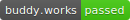
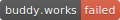
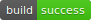
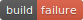
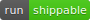
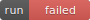

# Badge 一覧

|CI|PASS|FAILE|
|:--|:-:|:-:|
|AppVeyor|||
|Azure Pipeliens|||
|Bitrise|||
|Buddy|||
|CircleCI|||
|Cirrus CI|||
|Codefresh|||
|Codeship|||
|Drone|||
|GitHub Actions|||
|Semaphore|||
|Shippable|||
|Travis CI|||
