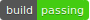
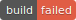

# Badge 一覧

|CI|PASS|FAIL|
|:--|:-:|:-:|
|AppVeyor         |          |          |
|Azure Pipelines  |   |   |
|Bitrise          |           |           |
|Buddy            |       |       |
|CircleCI         |          |          |
|Cirrus CI        |         |         |
|Codefresh        |         |         |
|CodeShip         |          |          |
|Drone            |             |             |
|GitHub Actions   |    |    |
|Semaphore        |         |         |
|Shippable        |         |         |
|Travis CI        |         |         |
|Wercker          |           |           |
